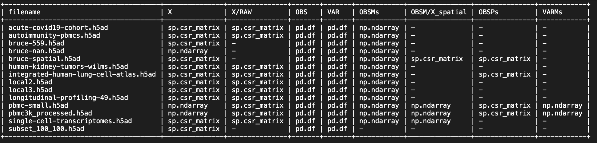

This is test code for reading ANN data and writing into a TileDB nested group structure.

# TL;DR

```
./tools/desc-ann ./anndata/pbmc3k_processed.h5ad

./tools/ingestor ./anndata/pbmc3k_processed.h5ad ./tiledb-data/pbmc3k_processed

./tools/desc-soma ./tiledb-data/pbmc3k_processed
```

# Installation

This requires [`tiledb`](https://github.com/TileDB-Inc/TileDB-Py) 0.14.1 or above, in addition to other dependencies
in [setup.cfg](./setup.cfg).

After `cd` to `apis/python`:

```
pip install --editable .
```

Optionally, if you prefer, instead:

```
python -m venv venv
. ./venv/bin/activate
pip install .
```

Then:

```
python -m pytest tests
```

# Overview

* Sample data:
  * [anndata](./anndata) contains some files from [https://cellxgene.cziscience.com](https://cellxgene.cziscience.com)
  * The most important reference is `anndata/pbmc3k_processed.h5ad`
* Code:
  * [./src/tiledbsc](./src/tiledbsc)
* Inspecting HDF5 input files
  * `./tools/desc-ann ./anndata/pbmc3k_processed.h5ad`
* Ingesting
  * `./tools/ingestor ./anndata/pbmc3k_processed.h5ad`
  * Output is in `tiledb-data/pbmc3k_processed`
  * Cloud-upload test:
    * `tools/ingestor ./anndata/pbmc3k_processed.h5ad tiledb://johnkerl-tiledb/s3://tiledb-johnkerl/wpv2-test-001`
* Inspecting TileDB output groups
  * `./tools/desc-soma ./tiledb-data/pbmc3k_processed`

# Status

Please see [https://github.com/single-cell-data/TileDB-SingleCell/issues](https://github.com/single-cell-data/TileDB-SingleCell/issues).

# Details

## TileDB group structure

Also shown: mental map for class names

```
TileDB group structure         SOMA classes                      AnnData types

soma: group
|
+-- X: group                   AssayMatrixGroup
|   +-- data: array              AssayMatrix                     scipy.sparse.csr_matrix, numpy.ndarray
|
+-- obs: array                 AnnotationDataFrame               pandas.DataFrame
|
+-- var: array                 AnnotationDataFrame               pandas.DataFrame
|
+-- obsm: group                AnnotationMatrixGroup             dict of:
|   +-- omfoo: array             AnnotationMatrix                numpy.ndarray, scipy.sparse.csr_matrix
|   +-- ombar: array             AnnotationMatrix
|
+-- varm: group                AnnotationMatrixGroup             dict of:
|   +-- vmfoo: array             AnnotationMatrix                numpy.ndarray, scipy.sparse.csr_matrix
|   +-- vmbar: array             AnnotationMatrix
|
+-- obsp: group                AnnotationPairwiseMatrixGroup     dict of:
|   +-- opfoo: array             AnnotationPairwiseMatrix        scipy.sparse.csr_matrix, numpy.ndarray
|   +-- opbar: array             AnnotationPairwiseMatrix
|
+-- varp: group                AnnotationPairwiseMatrixGroup     dict of:
|   +-- vpfoo: array             AnnotationPairwiseMatrix        scipy.sparse.csr_matrix, numpy.ndarray
|   +-- vpbar: array             AnnotationPairwiseMatrix
|
+-- raw: group                 RawGroup
|   |
|   +-- X: group                 AssayMatrixGroup
|   |   +-- data: array            AssayMatrix                   scipy.sparse.csr_matrix
|   |
|   +-- var: array               AnnotationDataFrame             pandas.DataFrame
|   |
|   +-- varm: group              AnnotationMatrixGroup
|   |   +-- vmfoo: array           AnnotationMatrix              numpy.ndarray, scipy.sparse.csr_matrix
|   |   +-- vmbar: array           AnnotationMatrix
|
+-- raw: group                 UnsGroup
    +-- ...: group
    |   +--: array                                               pandas.DataFrame, or
    |   +--: array                                               numpy.ndarray, or
    |   +--: array                                               numpy scalars,
    |   +--: array                                               etc.
    |   +--: group
    |   +--: group
    |        +... etc (nestable)
    |
    +-- ...: group
```

## Example data

This serves both as a concrete example of what the data looks like, as well as some of the soma methods.

Look at information about a sample `.h5ad` file:

<details>

```
$ ./tools/desc-ann anndata/pbmc-small.h5ad

================================================================ anndata/pbmc-small.h5ad

----------------------------------------------------------------
ANNDATA SUMMARY:
AnnData object with n_obs × n_vars = 80 × 20
    obs: 'orig.ident', 'nCount_RNA', 'nFeature_RNA', 'RNA_snn_res.0.8', 'letter.idents', 'groups', 'RNA_snn_res.1'
    var: 'vst.mean', 'vst.variance', 'vst.variance.expected', 'vst.variance.standardized', 'vst.variable'
    uns: 'neighbors'
    obsm: 'X_pca', 'X_tsne'
    varm: 'PCs'
    obsp: 'distances'
X SHAPE   (80, 20)
OBS  LEN  80
VAR  LEN  20
OBS IS A <class 'pandas.core.frame.DataFrame'>
   orig.ident int32
   nCount_RNA float64
   nFeature_RNA int32
   RNA_snn_res.0.8 int32
   letter.idents int32
   groups category
   RNA_snn_res.1 int32
VAR IS A <class 'pandas.core.frame.DataFrame'>
   vst.mean float64
   vst.variance float64
   vst.variance.expected float64
   vst.variance.standardized float64
   vst.variable int32
RAW X SHAPE   (80, 230)
OBS  KEYS ['orig.ident', 'nCount_RNA', 'nFeature_RNA', 'RNA_snn_res.0.8', 'letter.idents', 'groups', 'RNA_snn_res.1']
VAR  KEYS ['vst.mean', 'vst.variance', 'vst.variance.expected', 'vst.variance.standardized', 'vst.variable']
OBSM KEYS ['X_pca', 'X_tsne']
VARM KEYS ['PCs']
OBSP KEYS ['distances']
VARP KEYS []
uns/neighbors/params/method

----------------------------------------------------------------
ANNDATA FILE TYPES:
X/data                                   <class 'numpy.ndarray'>
X/data shape                             (80, 20)
X/data dtype                             float64
X/raw                                    <class 'scipy.sparse._csr.csr_matrix'>
X/raw shape                              (80, 230)
X/data dtype                             float64
X/raw density                            0.2422
obs                                      <class 'pandas.core.frame.DataFrame'>
var                                      <class 'pandas.core.frame.DataFrame'>
obsm/X_pca                               <class 'numpy.ndarray'>
obsm/X_tsne                              <class 'numpy.ndarray'>
varm/PCs                                 <class 'numpy.ndarray'>
obsp/distances                           <class 'scipy.sparse._csr.csr_matrix'>
uns/neighbors/params/method              (1,) <class 'numpy.ndarray'> object
```

See also:

```
h5ls     anndata/pmbc-small.h5ad
h5ls     anndata/pbmc3k_processed.h5ad
h5ls -r  anndata/pbmc3k_processed.h5ad
h5ls -vr anndata/pbmc3k_processed.h5ad
# etc.
```

</details>

Read a sample `.h5ad` file and write into a TileDB SOMA object:

```
$ tools/ingestor anndata/pbmc-small.h5ad tiledb-data/pbmc-small
```

Look at various fields:

<details>

```
$ python

>>> import tiledbsc

>>> soma = tiledbsc.SOMA('tiledb-data/pbmc-small')
>>> arr = soma.X.data.open_array()
>>> arr.df[:]
              obs_id    var_id     value
0     AAATTCGAATCACG    AKR1C3 -0.325888
1     AAATTCGAATCACG       CA2 -0.346938
...              ...       ...       ...
1598  TTTAGCTGTACTCT     TUBB1 -0.350375
1599  TTTAGCTGTACTCT     VDAC3 -0.524551

[1600 rows x 3 columns]
-- Note this is a sparse matrix in IJV/COO format
```

```
>>> arr = soma.obs.open_array()
>>> arr.df[:]
                orig.ident  nCount_RNA  nFeature_RNA  RNA_snn_res.0.8  letter.idents groups  RNA_snn_res.1
obs_id
AAATTCGAATCACG           0       327.0            62                1              1     g2              1
AAGCAAGAGCTTAG           0       126.0            48                0              0     g1              0
...                    ...         ...           ...              ...            ...    ...            ...
TTGGTACTGAATCC           0       135.0            45                0              0     g1              2
TTTAGCTGTACTCT           0       462.0            86                1              1     g1              1

[80 rows x 7 columns]

>>> arr = soma.var.open_array()
>>> arr.df[:]
               vst.mean  vst.variance  vst.variance.expected  vst.variance.standardized  vst.variable
var_id
AKR1C3           0.2625      1.132753               0.553424                   2.021191             1
CA2              0.4500      3.263291               1.685451                   1.765922             1
CD1C             0.1750      0.576582               0.271217                   2.052014             1
...
TREML1           0.3375      1.365665               0.761869                   1.792519             1
TUBB1            0.8875     16.202373               6.352400                   1.634371             1
VDAC3            1.1250     30.971519               8.986513                   2.137607             1
```

```
>>> soma.obsm.get_member_names()
['X_tsne', 'X_pca']
>>> arr = soma.obsm['X_pca'].open_array()
>>> arr.df[:]
            obs_id   X_pca_1   X_pca_2 ...  X_pca_18  X_pca_19
0   AAATTCGAATCACG -0.599730  0.970809 ... -0.127195  0.026804
1   AAGCAAGAGCTTAG -0.919219 -2.043828 ...  0.009386 -0.019896
2   AAGCGACTTTGACG -1.380380  1.284101 ... -0.041855  0.027550
..             ...       ...       ... ...       ...       ...
78  TTGGTACTGAATCC -1.418764  0.764986 ... -0.064450  0.099118
79  TTTAGCTGTACTCT -1.447483  1.583223 ... -0.014984  0.033992

[80 rows x 20 columns]
```

```
>>> arr = soma.raw.X.data.open_array()
>>> arr.df[:]
              obs_id   var_id     value
0     AAATTCGAATCACG     ADAR  3.452557
1     AAATTCGAATCACG     AIF1  3.452557
...              ...      ...       ...
4454  TTTAGCTGTACTCT     XBP1  3.119940
4455  TTTAGCTGTACTCT  ZFP36L1  3.119940

[4456 rows x 3 columns]
```

```
>>> soma.uns.get_member_names()
['neighbors']
>>> soma.uns['neighbors'].get_member_names()
['params']
>>> soma.uns['neighbors']['params'].get_member_names()
['method']
>>> arr = soma.uns['neighbors']['params']['method'].open_array()
>>> arr.df[:]
   __dim_0
0        0  snn
```

</details>

## Expected ingestion progress

`./tools/ingestor ./anndata/pbmc3k_processed.h5ad ./tiledb-data/pbmc3k_processed`

<details>

```
START  SOMA.from_h5ad ./anndata/pbmc3k_processed.h5ad -> ./tiledb-data/pbmc3k_processed
START  READING ./anndata/pbmc3k_processed.h5ad
FINISH READING ./anndata/pbmc3k_processed.h5ad TIME 0.227
START  DECATEGORICALIZING
FINISH DECATEGORICALIZING TIME 0.006
START  WRITING ./tiledb-data/pbmc3k_processed
Creating TileDB group ./tiledb-data/pbmc3k_processed
  Creating TileDB group ./tiledb-data/pbmc3k_processed/X
    START  WRITING ./tiledb-data/pbmc3k_processed/X/data
    FINISH WRITING ./tiledb-data/pbmc3k_processed/X/data TIME 9.262
  START  WRITING ./tiledb-data/pbmc3k_processed/obs
  FINISH WRITING ./tiledb-data/pbmc3k_processed/obs TIME 0.085
  START  WRITING ./tiledb-data/pbmc3k_processed/var
  FINISH WRITING ./tiledb-data/pbmc3k_processed/var TIME 0.024
  Creating TileDB group ./tiledb-data/pbmc3k_processed/obsm
    START  WRITING ./tiledb-data/pbmc3k_processed/obsm/X_draw_graph_fr
    FINISH WRITING ./tiledb-data/pbmc3k_processed/obsm/X_draw_graph_fr TIME 0.053
    START  WRITING ./tiledb-data/pbmc3k_processed/obsm/X_pca
    FINISH WRITING ./tiledb-data/pbmc3k_processed/obsm/X_pca TIME 0.247
    START  WRITING ./tiledb-data/pbmc3k_processed/obsm/X_tsne
    FINISH WRITING ./tiledb-data/pbmc3k_processed/obsm/X_tsne TIME 0.059
    START  WRITING ./tiledb-data/pbmc3k_processed/obsm/X_umap
    FINISH WRITING ./tiledb-data/pbmc3k_processed/obsm/X_umap TIME 0.058
  Creating TileDB group ./tiledb-data/pbmc3k_processed/varm
    START  WRITING ./tiledb-data/pbmc3k_processed/varm/PCs
    FINISH WRITING ./tiledb-data/pbmc3k_processed/varm/PCs TIME 0.175
  Creating TileDB group ./tiledb-data/pbmc3k_processed/obsp
    START  WRITING ./tiledb-data/pbmc3k_processed/obsp/connectivities
    START  __ingest_coo_data_string_dims_rows_chunked
    START  chunk rows 0..2638 of 2638, obs_ids AAACATACAACCAC-1..TTTGCATGCCTCAC-1, nnz=42406, 100.000%
    FINISH chunk TIME 0.318
    FINISH __ingest_coo_data_string_dims_rows_chunked TIME 0.825
    FINISH WRITING ./tiledb-data/pbmc3k_processed/obsp/connectivities TIME 0.831
    START  WRITING ./tiledb-data/pbmc3k_processed/obsp/distances
    START  __ingest_coo_data_string_dims_rows_chunked
    START  chunk rows 0..2638 of 2638, obs_ids AAACATACAACCAC-1..TTTGCATGCCTCAC-1, nnz=23742, 100.000%
    FINISH chunk TIME 0.149
    FINISH __ingest_coo_data_string_dims_rows_chunked TIME 0.637
    FINISH WRITING ./tiledb-data/pbmc3k_processed/obsp/distances TIME 0.647
  Creating TileDB group ./tiledb-data/pbmc3k_processed/varp
  START  WRITING ./tiledb-data/pbmc3k_processed/raw
  Creating TileDB group ./tiledb-data/pbmc3k_processed/raw
    Creating TileDB group ./tiledb-data/pbmc3k_processed/raw/X
      START  WRITING ./tiledb-data/pbmc3k_processed/raw/X/data
      START  __ingest_coo_data_string_dims_rows_chunked
      START  chunk rows 0..2638 of 2638, obs_ids AAACATACAACCAC-1..TTTGCATGCCTCAC-1, nnz=2238732, 100.000%
      FINISH chunk TIME 5.736
      FINISH __ingest_coo_data_string_dims_rows_chunked TIME 6.301
      FINISH WRITING ./tiledb-data/pbmc3k_processed/raw/X/data TIME 6.338
    START  WRITING ./tiledb-data/pbmc3k_processed/raw/var
    FINISH WRITING ./tiledb-data/pbmc3k_processed/raw/var TIME 0.056
    Creating TileDB group ./tiledb-data/pbmc3k_processed/raw/varm
  FINISH WRITING ./tiledb-data/pbmc3k_processed/raw TIME 6.400
  START  WRITING ./tiledb-data/pbmc3k_processed/uns
  Creating TileDB group ./tiledb-data/pbmc3k_processed/uns
    START  WRITING ./tiledb-data/pbmc3k_processed/uns/draw_graph
    Creating TileDB group ./tiledb-data/pbmc3k_processed/uns/draw_graph
      START  WRITING ./tiledb-data/pbmc3k_processed/uns/draw_graph/params
      Creating TileDB group ./tiledb-data/pbmc3k_processed/uns/draw_graph/params
        START  WRITING FROM NUMPY.NDARRAY ./tiledb-data/pbmc3k_processed/uns/draw_graph/params/layout
        FINISH WRITING FROM NUMPY.NDARRAY ./tiledb-data/pbmc3k_processed/uns/draw_graph/params/layout TIME 0.018
        START  WRITING FROM NUMPY.NDARRAY ./tiledb-data/pbmc3k_processed/uns/draw_graph/params/random_state
        FINISH WRITING FROM NUMPY.NDARRAY ./tiledb-data/pbmc3k_processed/uns/draw_graph/params/random_state TIME 0.016
      FINISH WRITING ./tiledb-data/pbmc3k_processed/uns/draw_graph/params TIME 0.036
    FINISH WRITING ./tiledb-data/pbmc3k_processed/uns/draw_graph TIME 0.038
    START  WRITING ./tiledb-data/pbmc3k_processed/uns/louvain
    Creating TileDB group ./tiledb-data/pbmc3k_processed/uns/louvain
      START  WRITING ./tiledb-data/pbmc3k_processed/uns/louvain/params
      Creating TileDB group ./tiledb-data/pbmc3k_processed/uns/louvain/params
        START  WRITING FROM NUMPY.NDARRAY ./tiledb-data/pbmc3k_processed/uns/louvain/params/random_state
        FINISH WRITING FROM NUMPY.NDARRAY ./tiledb-data/pbmc3k_processed/uns/louvain/params/random_state TIME 0.017
        START  WRITING FROM NUMPY.NDARRAY ./tiledb-data/pbmc3k_processed/uns/louvain/params/resolution
        FINISH WRITING FROM NUMPY.NDARRAY ./tiledb-data/pbmc3k_processed/uns/louvain/params/resolution TIME 0.017
      FINISH WRITING ./tiledb-data/pbmc3k_processed/uns/louvain/params TIME 0.036
    FINISH WRITING ./tiledb-data/pbmc3k_processed/uns/louvain TIME 0.039
    START  WRITING FROM NUMPY.NDARRAY ./tiledb-data/pbmc3k_processed/uns/louvain_colors
    FINISH WRITING FROM NUMPY.NDARRAY ./tiledb-data/pbmc3k_processed/uns/louvain_colors TIME 0.018
    START  WRITING ./tiledb-data/pbmc3k_processed/uns/neighbors
    Creating TileDB group ./tiledb-data/pbmc3k_processed/uns/neighbors
      START  WRITING ./tiledb-data/pbmc3k_processed/uns/neighbors/params
      Creating TileDB group ./tiledb-data/pbmc3k_processed/uns/neighbors/params
        START  WRITING FROM NUMPY.NDARRAY ./tiledb-data/pbmc3k_processed/uns/neighbors/params/method
        FINISH WRITING FROM NUMPY.NDARRAY ./tiledb-data/pbmc3k_processed/uns/neighbors/params/method TIME 0.017
        START  WRITING FROM NUMPY.NDARRAY ./tiledb-data/pbmc3k_processed/uns/neighbors/params/n_neighbors
        FINISH WRITING FROM NUMPY.NDARRAY ./tiledb-data/pbmc3k_processed/uns/neighbors/params/n_neighbors TIME 0.017
      FINISH WRITING ./tiledb-data/pbmc3k_processed/uns/neighbors/params TIME 0.036
    FINISH WRITING ./tiledb-data/pbmc3k_processed/uns/neighbors TIME 0.038
    START  WRITING ./tiledb-data/pbmc3k_processed/uns/pca
    Creating TileDB group ./tiledb-data/pbmc3k_processed/uns/pca
      START  WRITING FROM NUMPY.NDARRAY ./tiledb-data/pbmc3k_processed/uns/pca/variance
      FINISH WRITING FROM NUMPY.NDARRAY ./tiledb-data/pbmc3k_processed/uns/pca/variance TIME 0.016
      START  WRITING FROM NUMPY.NDARRAY ./tiledb-data/pbmc3k_processed/uns/pca/variance_ratio
      FINISH WRITING FROM NUMPY.NDARRAY ./tiledb-data/pbmc3k_processed/uns/pca/variance_ratio TIME 0.016
    FINISH WRITING ./tiledb-data/pbmc3k_processed/uns/pca TIME 0.034
      Skipping structured array: ./tiledb-data/pbmc3k_processed/uns/rank_genes_groups
  FINISH WRITING ./tiledb-data/pbmc3k_processed/uns TIME 0.171
FINISH WRITING ./tiledb-data/pbmc3k_processed TIME 18.037
FINISH SOMA.from_h5ad ./anndata/pbmc3k_processed.h5ad -> ./tiledb-data/pbmc3k_processed TIME 18.271
```

</details>

## Expected output format

`./tools/desc-soma ./tiledb-data/pbmc3k_processed`

<details>

```
----------------------------------------------------------------
Array: ./tiledb-data/pbmc3k_processed/X/data
ArraySchema(
  domain=Domain(*[
    Dim(name='obs_id', domain=(None, None), tile=None, dtype='|S0', var=True, filters=FilterList([RleFilter(), ])),
    Dim(name='var_id', domain=(None, None), tile=None, dtype='|S0', var=True, filters=FilterList([ZstdFilter(level=22), ])),
  ]),
  attrs=[
    Attr(name='value', dtype='float32', var=False, nullable=False, filters=FilterList([ZstdFilter(level=-1), ])),
  ],
  cell_order='row-major',
  tile_order='row-major',
  capacity=100000,
  sparse=True,
  allows_duplicates=True,
)

----------------------------------------------------------------
Array: ./tiledb-data/pbmc3k_processed/obs
ArraySchema(
  domain=Domain(*[
    Dim(name='obs_id', domain=(None, None), tile=None, dtype='|S0', var=True, filters=FilterList([ZstdFilter(level=-1), ])),
  ]),
  attrs=[
    Attr(name='n_genes', dtype='int64', var=False, nullable=False, filters=FilterList([ZstdFilter(level=-1), ])),
    Attr(name='percent_mito', dtype='float32', var=False, nullable=False, filters=FilterList([ZstdFilter(level=-1), ])),
    Attr(name='n_counts', dtype='float32', var=False, nullable=False, filters=FilterList([ZstdFilter(level=-1), ])),
    Attr(name='louvain', dtype='<U0', var=True, nullable=False, filters=FilterList([ZstdFilter(level=-1), ])),
  ],
  cell_order='row-major',
  tile_order='row-major',
  capacity=100000,
  sparse=True,
  allows_duplicates=False,
)

----------------------------------------------------------------
Array: ./tiledb-data/pbmc3k_processed/var
ArraySchema(
  domain=Domain(*[
    Dim(name='var_id', domain=(None, None), tile=None, dtype='|S0', var=True, filters=FilterList([ZstdFilter(level=-1), ])),
  ]),
  attrs=[
    Attr(name='n_cells', dtype='int64', var=False, nullable=False, filters=FilterList([ZstdFilter(level=-1), ])),
  ],
  cell_order='row-major',
  tile_order='row-major',
  capacity=100000,
  sparse=True,
  allows_duplicates=False,
)

----------------------------------------------------------------
Array: file:///Users/johnkerl/git/single-cell-data/TileDB-SingleCell/apis/python/tiledb-data/pbmc3k_processed/obsm/X_umap
ArraySchema(
  domain=Domain(*[
    Dim(name='obs_id', domain=(None, None), tile=None, dtype='|S0', var=True, filters=FilterList([ZstdFilter(level=22), ])),
  ]),
  attrs=[
    Attr(name='X_umap_1', dtype='float64', var=False, nullable=False, filters=FilterList([ZstdFilter(level=-1), ])),
    Attr(name='X_umap_2', dtype='float64', var=False, nullable=False, filters=FilterList([ZstdFilter(level=-1), ])),
  ],
  cell_order='row-major',
  tile_order='row-major',
  capacity=100000,
  sparse=True,
  allows_duplicates=True,
)

----------------------------------------------------------------
Array: file:///Users/johnkerl/git/single-cell-data/TileDB-SingleCell/apis/python/tiledb-data/pbmc3k_processed/obsm/X_tsne
ArraySchema(
  domain=Domain(*[
    Dim(name='obs_id', domain=(None, None), tile=None, dtype='|S0', var=True, filters=FilterList([ZstdFilter(level=22), ])),
  ]),
  attrs=[
    Attr(name='X_tsne_1', dtype='float64', var=False, nullable=False, filters=FilterList([ZstdFilter(level=-1), ])),
    Attr(name='X_tsne_2', dtype='float64', var=False, nullable=False, filters=FilterList([ZstdFilter(level=-1), ])),
  ],
  cell_order='row-major',
  tile_order='row-major',
  capacity=100000,
  sparse=True,
  allows_duplicates=True,
)

----------------------------------------------------------------
Array: file:///Users/johnkerl/git/single-cell-data/TileDB-SingleCell/apis/python/tiledb-data/pbmc3k_processed/obsm/X_pca
ArraySchema(
  domain=Domain(*[
    Dim(name='obs_id', domain=(None, None), tile=None, dtype='|S0', var=True, filters=FilterList([ZstdFilter(level=22), ])),
  ]),
  attrs=[
    Attr(name='X_pca_1', dtype='float32', var=False, nullable=False, filters=FilterList([ZstdFilter(level=-1), ])),
    Attr(name='X_pca_2', dtype='float32', var=False, nullable=False, filters=FilterList([ZstdFilter(level=-1), ])),
    Attr(name='X_pca_3', dtype='float32', var=False, nullable=False, filters=FilterList([ZstdFilter(level=-1), ])),
    Attr(name='X_pca_4', dtype='float32', var=False, nullable=False, filters=FilterList([ZstdFilter(level=-1), ])),
    Attr(name='X_pca_5', dtype='float32', var=False, nullable=False, filters=FilterList([ZstdFilter(level=-1), ])),
    Attr(name='X_pca_6', dtype='float32', var=False, nullable=False, filters=FilterList([ZstdFilter(level=-1), ])),
    Attr(name='X_pca_7', dtype='float32', var=False, nullable=False, filters=FilterList([ZstdFilter(level=-1), ])),
    Attr(name='X_pca_8', dtype='float32', var=False, nullable=False, filters=FilterList([ZstdFilter(level=-1), ])),
    Attr(name='X_pca_9', dtype='float32', var=False, nullable=False, filters=FilterList([ZstdFilter(level=-1), ])),
    Attr(name='X_pca_10', dtype='float32', var=False, nullable=False, filters=FilterList([ZstdFilter(level=-1), ])),
    Attr(name='X_pca_11', dtype='float32', var=False, nullable=False, filters=FilterList([ZstdFilter(level=-1), ])),
    Attr(name='X_pca_12', dtype='float32', var=False, nullable=False, filters=FilterList([ZstdFilter(level=-1), ])),
    Attr(name='X_pca_13', dtype='float32', var=False, nullable=False, filters=FilterList([ZstdFilter(level=-1), ])),
    Attr(name='X_pca_14', dtype='float32', var=False, nullable=False, filters=FilterList([ZstdFilter(level=-1), ])),
    Attr(name='X_pca_15', dtype='float32', var=False, nullable=False, filters=FilterList([ZstdFilter(level=-1), ])),
    Attr(name='X_pca_16', dtype='float32', var=False, nullable=False, filters=FilterList([ZstdFilter(level=-1), ])),
    Attr(name='X_pca_17', dtype='float32', var=False, nullable=False, filters=FilterList([ZstdFilter(level=-1), ])),
    Attr(name='X_pca_18', dtype='float32', var=False, nullable=False, filters=FilterList([ZstdFilter(level=-1), ])),
    Attr(name='X_pca_19', dtype='float32', var=False, nullable=False, filters=FilterList([ZstdFilter(level=-1), ])),
    Attr(name='X_pca_20', dtype='float32', var=False, nullable=False, filters=FilterList([ZstdFilter(level=-1), ])),
    Attr(name='X_pca_21', dtype='float32', var=False, nullable=False, filters=FilterList([ZstdFilter(level=-1), ])),
    Attr(name='X_pca_22', dtype='float32', var=False, nullable=False, filters=FilterList([ZstdFilter(level=-1), ])),
    Attr(name='X_pca_23', dtype='float32', var=False, nullable=False, filters=FilterList([ZstdFilter(level=-1), ])),
    Attr(name='X_pca_24', dtype='float32', var=False, nullable=False, filters=FilterList([ZstdFilter(level=-1), ])),
    Attr(name='X_pca_25', dtype='float32', var=False, nullable=False, filters=FilterList([ZstdFilter(level=-1), ])),
    Attr(name='X_pca_26', dtype='float32', var=False, nullable=False, filters=FilterList([ZstdFilter(level=-1), ])),
    Attr(name='X_pca_27', dtype='float32', var=False, nullable=False, filters=FilterList([ZstdFilter(level=-1), ])),
    Attr(name='X_pca_28', dtype='float32', var=False, nullable=False, filters=FilterList([ZstdFilter(level=-1), ])),
    Attr(name='X_pca_29', dtype='float32', var=False, nullable=False, filters=FilterList([ZstdFilter(level=-1), ])),
    Attr(name='X_pca_30', dtype='float32', var=False, nullable=False, filters=FilterList([ZstdFilter(level=-1), ])),
    Attr(name='X_pca_31', dtype='float32', var=False, nullable=False, filters=FilterList([ZstdFilter(level=-1), ])),
    Attr(name='X_pca_32', dtype='float32', var=False, nullable=False, filters=FilterList([ZstdFilter(level=-1), ])),
    Attr(name='X_pca_33', dtype='float32', var=False, nullable=False, filters=FilterList([ZstdFilter(level=-1), ])),
    Attr(name='X_pca_34', dtype='float32', var=False, nullable=False, filters=FilterList([ZstdFilter(level=-1), ])),
    Attr(name='X_pca_35', dtype='float32', var=False, nullable=False, filters=FilterList([ZstdFilter(level=-1), ])),
    Attr(name='X_pca_36', dtype='float32', var=False, nullable=False, filters=FilterList([ZstdFilter(level=-1), ])),
    Attr(name='X_pca_37', dtype='float32', var=False, nullable=False, filters=FilterList([ZstdFilter(level=-1), ])),
    Attr(name='X_pca_38', dtype='float32', var=False, nullable=False, filters=FilterList([ZstdFilter(level=-1), ])),
    Attr(name='X_pca_39', dtype='float32', var=False, nullable=False, filters=FilterList([ZstdFilter(level=-1), ])),
    Attr(name='X_pca_40', dtype='float32', var=False, nullable=False, filters=FilterList([ZstdFilter(level=-1), ])),
    Attr(name='X_pca_41', dtype='float32', var=False, nullable=False, filters=FilterList([ZstdFilter(level=-1), ])),
    Attr(name='X_pca_42', dtype='float32', var=False, nullable=False, filters=FilterList([ZstdFilter(level=-1), ])),
    Attr(name='X_pca_43', dtype='float32', var=False, nullable=False, filters=FilterList([ZstdFilter(level=-1), ])),
    Attr(name='X_pca_44', dtype='float32', var=False, nullable=False, filters=FilterList([ZstdFilter(level=-1), ])),
    Attr(name='X_pca_45', dtype='float32', var=False, nullable=False, filters=FilterList([ZstdFilter(level=-1), ])),
    Attr(name='X_pca_46', dtype='float32', var=False, nullable=False, filters=FilterList([ZstdFilter(level=-1), ])),
    Attr(name='X_pca_47', dtype='float32', var=False, nullable=False, filters=FilterList([ZstdFilter(level=-1), ])),
    Attr(name='X_pca_48', dtype='float32', var=False, nullable=False, filters=FilterList([ZstdFilter(level=-1), ])),
    Attr(name='X_pca_49', dtype='float32', var=False, nullable=False, filters=FilterList([ZstdFilter(level=-1), ])),
    Attr(name='X_pca_50', dtype='float32', var=False, nullable=False, filters=FilterList([ZstdFilter(level=-1), ])),
  ],
  cell_order='row-major',
  tile_order='row-major',
  capacity=100000,
  sparse=True,
  allows_duplicates=True,
)

----------------------------------------------------------------
Array: file:///Users/johnkerl/git/single-cell-data/TileDB-SingleCell/apis/python/tiledb-data/pbmc3k_processed/obsm/X_draw_graph_fr
ArraySchema(
  domain=Domain(*[
    Dim(name='obs_id', domain=(None, None), tile=None, dtype='|S0', var=True, filters=FilterList([ZstdFilter(level=22), ])),
  ]),
  attrs=[
    Attr(name='X_draw_graph_fr_1', dtype='float64', var=False, nullable=False, filters=FilterList([ZstdFilter(level=-1), ])),
    Attr(name='X_draw_graph_fr_2', dtype='float64', var=False, nullable=False, filters=FilterList([ZstdFilter(level=-1), ])),
  ],
  cell_order='row-major',
  tile_order='row-major',
  capacity=100000,
  sparse=True,
  allows_duplicates=True,
)

----------------------------------------------------------------
Array: file:///Users/johnkerl/git/single-cell-data/TileDB-SingleCell/apis/python/tiledb-data/pbmc3k_processed/varm/PCs
ArraySchema(
  domain=Domain(*[
    Dim(name='var_id', domain=(None, None), tile=None, dtype='|S0', var=True, filters=FilterList([ZstdFilter(level=22), ])),
  ]),
  attrs=[
    Attr(name='PCs_1', dtype='float32', var=False, nullable=False, filters=FilterList([ZstdFilter(level=-1), ])),
    Attr(name='PCs_2', dtype='float32', var=False, nullable=False, filters=FilterList([ZstdFilter(level=-1), ])),
    Attr(name='PCs_3', dtype='float32', var=False, nullable=False, filters=FilterList([ZstdFilter(level=-1), ])),
    Attr(name='PCs_4', dtype='float32', var=False, nullable=False, filters=FilterList([ZstdFilter(level=-1), ])),
    Attr(name='PCs_5', dtype='float32', var=False, nullable=False, filters=FilterList([ZstdFilter(level=-1), ])),
    Attr(name='PCs_6', dtype='float32', var=False, nullable=False, filters=FilterList([ZstdFilter(level=-1), ])),
    Attr(name='PCs_7', dtype='float32', var=False, nullable=False, filters=FilterList([ZstdFilter(level=-1), ])),
    Attr(name='PCs_8', dtype='float32', var=False, nullable=False, filters=FilterList([ZstdFilter(level=-1), ])),
    Attr(name='PCs_9', dtype='float32', var=False, nullable=False, filters=FilterList([ZstdFilter(level=-1), ])),
    Attr(name='PCs_10', dtype='float32', var=False, nullable=False, filters=FilterList([ZstdFilter(level=-1), ])),
    Attr(name='PCs_11', dtype='float32', var=False, nullable=False, filters=FilterList([ZstdFilter(level=-1), ])),
    Attr(name='PCs_12', dtype='float32', var=False, nullable=False, filters=FilterList([ZstdFilter(level=-1), ])),
    Attr(name='PCs_13', dtype='float32', var=False, nullable=False, filters=FilterList([ZstdFilter(level=-1), ])),
    Attr(name='PCs_14', dtype='float32', var=False, nullable=False, filters=FilterList([ZstdFilter(level=-1), ])),
    Attr(name='PCs_15', dtype='float32', var=False, nullable=False, filters=FilterList([ZstdFilter(level=-1), ])),
    Attr(name='PCs_16', dtype='float32', var=False, nullable=False, filters=FilterList([ZstdFilter(level=-1), ])),
    Attr(name='PCs_17', dtype='float32', var=False, nullable=False, filters=FilterList([ZstdFilter(level=-1), ])),
    Attr(name='PCs_18', dtype='float32', var=False, nullable=False, filters=FilterList([ZstdFilter(level=-1), ])),
    Attr(name='PCs_19', dtype='float32', var=False, nullable=False, filters=FilterList([ZstdFilter(level=-1), ])),
    Attr(name='PCs_20', dtype='float32', var=False, nullable=False, filters=FilterList([ZstdFilter(level=-1), ])),
    Attr(name='PCs_21', dtype='float32', var=False, nullable=False, filters=FilterList([ZstdFilter(level=-1), ])),
    Attr(name='PCs_22', dtype='float32', var=False, nullable=False, filters=FilterList([ZstdFilter(level=-1), ])),
    Attr(name='PCs_23', dtype='float32', var=False, nullable=False, filters=FilterList([ZstdFilter(level=-1), ])),
    Attr(name='PCs_24', dtype='float32', var=False, nullable=False, filters=FilterList([ZstdFilter(level=-1), ])),
    Attr(name='PCs_25', dtype='float32', var=False, nullable=False, filters=FilterList([ZstdFilter(level=-1), ])),
    Attr(name='PCs_26', dtype='float32', var=False, nullable=False, filters=FilterList([ZstdFilter(level=-1), ])),
    Attr(name='PCs_27', dtype='float32', var=False, nullable=False, filters=FilterList([ZstdFilter(level=-1), ])),
    Attr(name='PCs_28', dtype='float32', var=False, nullable=False, filters=FilterList([ZstdFilter(level=-1), ])),
    Attr(name='PCs_29', dtype='float32', var=False, nullable=False, filters=FilterList([ZstdFilter(level=-1), ])),
    Attr(name='PCs_30', dtype='float32', var=False, nullable=False, filters=FilterList([ZstdFilter(level=-1), ])),
    Attr(name='PCs_31', dtype='float32', var=False, nullable=False, filters=FilterList([ZstdFilter(level=-1), ])),
    Attr(name='PCs_32', dtype='float32', var=False, nullable=False, filters=FilterList([ZstdFilter(level=-1), ])),
    Attr(name='PCs_33', dtype='float32', var=False, nullable=False, filters=FilterList([ZstdFilter(level=-1), ])),
    Attr(name='PCs_34', dtype='float32', var=False, nullable=False, filters=FilterList([ZstdFilter(level=-1), ])),
    Attr(name='PCs_35', dtype='float32', var=False, nullable=False, filters=FilterList([ZstdFilter(level=-1), ])),
    Attr(name='PCs_36', dtype='float32', var=False, nullable=False, filters=FilterList([ZstdFilter(level=-1), ])),
    Attr(name='PCs_37', dtype='float32', var=False, nullable=False, filters=FilterList([ZstdFilter(level=-1), ])),
    Attr(name='PCs_38', dtype='float32', var=False, nullable=False, filters=FilterList([ZstdFilter(level=-1), ])),
    Attr(name='PCs_39', dtype='float32', var=False, nullable=False, filters=FilterList([ZstdFilter(level=-1), ])),
    Attr(name='PCs_40', dtype='float32', var=False, nullable=False, filters=FilterList([ZstdFilter(level=-1), ])),
    Attr(name='PCs_41', dtype='float32', var=False, nullable=False, filters=FilterList([ZstdFilter(level=-1), ])),
    Attr(name='PCs_42', dtype='float32', var=False, nullable=False, filters=FilterList([ZstdFilter(level=-1), ])),
    Attr(name='PCs_43', dtype='float32', var=False, nullable=False, filters=FilterList([ZstdFilter(level=-1), ])),
    Attr(name='PCs_44', dtype='float32', var=False, nullable=False, filters=FilterList([ZstdFilter(level=-1), ])),
    Attr(name='PCs_45', dtype='float32', var=False, nullable=False, filters=FilterList([ZstdFilter(level=-1), ])),
    Attr(name='PCs_46', dtype='float32', var=False, nullable=False, filters=FilterList([ZstdFilter(level=-1), ])),
    Attr(name='PCs_47', dtype='float32', var=False, nullable=False, filters=FilterList([ZstdFilter(level=-1), ])),
    Attr(name='PCs_48', dtype='float32', var=False, nullable=False, filters=FilterList([ZstdFilter(level=-1), ])),
    Attr(name='PCs_49', dtype='float32', var=False, nullable=False, filters=FilterList([ZstdFilter(level=-1), ])),
    Attr(name='PCs_50', dtype='float32', var=False, nullable=False, filters=FilterList([ZstdFilter(level=-1), ])),
  ],
  cell_order='row-major',
  tile_order='row-major',
  capacity=100000,
  sparse=True,
  allows_duplicates=True,
)

----------------------------------------------------------------
Array: file:///Users/johnkerl/git/single-cell-data/TileDB-SingleCell/apis/python/tiledb-data/pbmc3k_processed/obsp/connectivities
ArraySchema(
  domain=Domain(*[
    Dim(name='obs_id_i', domain=(None, None), tile=None, dtype='|S0', var=True, filters=FilterList([RleFilter(), ])),
    Dim(name='obs_id_j', domain=(None, None), tile=None, dtype='|S0', var=True, filters=FilterList([ZstdFilter(level=22), ])),
  ]),
  attrs=[
    Attr(name='value', dtype='float64', var=False, nullable=False, filters=FilterList([ZstdFilter(level=-1), ])),
  ],
  cell_order='row-major',
  tile_order='row-major',
  capacity=100000,
  sparse=True,
  allows_duplicates=True,
)

----------------------------------------------------------------
Array: file:///Users/johnkerl/git/single-cell-data/TileDB-SingleCell/apis/python/tiledb-data/pbmc3k_processed/obsp/distances
ArraySchema(
  domain=Domain(*[
    Dim(name='obs_id_i', domain=(None, None), tile=None, dtype='|S0', var=True, filters=FilterList([RleFilter(), ])),
    Dim(name='obs_id_j', domain=(None, None), tile=None, dtype='|S0', var=True, filters=FilterList([ZstdFilter(level=22), ])),
  ]),
  attrs=[
    Attr(name='value', dtype='float64', var=False, nullable=False, filters=FilterList([ZstdFilter(level=-1), ])),
  ],
  cell_order='row-major',
  tile_order='row-major',
  capacity=100000,
  sparse=True,
  allows_duplicates=True,
)

----------------------------------------------------------------
Array: ./tiledb-data/pbmc3k_processed/raw/X/data
ArraySchema(
  domain=Domain(*[
    Dim(name='obs_id', domain=(None, None), tile=None, dtype='|S0', var=True, filters=FilterList([RleFilter(), ])),
    Dim(name='var_id', domain=(None, None), tile=None, dtype='|S0', var=True, filters=FilterList([ZstdFilter(level=22), ])),
  ]),
  attrs=[
    Attr(name='value', dtype='float32', var=False, nullable=False, filters=FilterList([ZstdFilter(level=-1), ])),
  ],
  cell_order='row-major',
  tile_order='row-major',
  capacity=100000,
  sparse=True,
  allows_duplicates=True,
)

----------------------------------------------------------------
Array: ./tiledb-data/pbmc3k_processed/raw/var
ArraySchema(
  domain=Domain(*[
    Dim(name='var_id', domain=(None, None), tile=None, dtype='|S0', var=True, filters=FilterList([ZstdFilter(level=-1), ])),
  ]),
  attrs=[
    Attr(name='n_cells', dtype='int64', var=False, nullable=False, filters=FilterList([ZstdFilter(level=-1), ])),
  ],
  cell_order='row-major',
  tile_order='row-major',
  capacity=100000,
  sparse=True,
  allows_duplicates=False,
)

```

</details>

See also:

```
import tiledb
print(tiledb.group.Group('tiledb-data/pbmc3k_processed'))
```

## Diversity of formats in HDF5 files

Due to file-size restrictions on GitHub, not all the following are cached in this repo.
Nonetheless this is a selection from
[https://cellxgene.cziscience.com](https://cellxgene.cziscience.com), as well as some
raw-sensor data (`subset_100_100`):



# Notes

* `os.path.join` is used here but may not be appropriate if this package is run on Windows:
  * `/` has been accepted in Windows paths for some years now
  * `\` is not accepted for forming URIs
  * So, perhaps safer would be to always join on `/` regardless of platform.
* For PRs: from within `apis/python`, run `black .` (or `black . --check to preview if you prefer) as this format-checker is run in CI.
