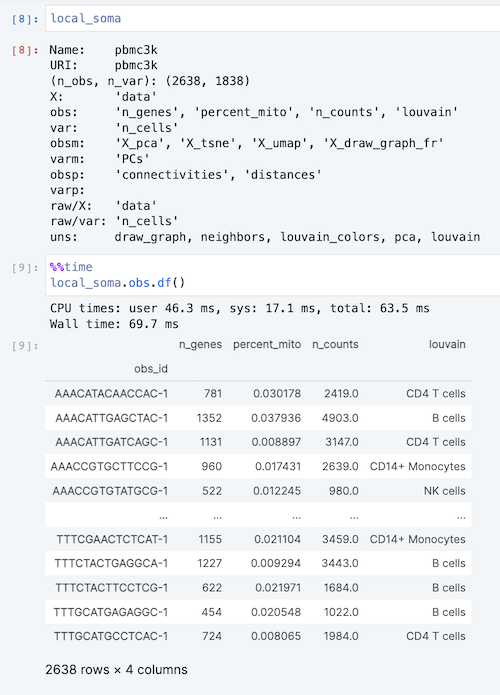
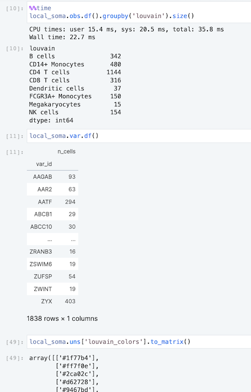
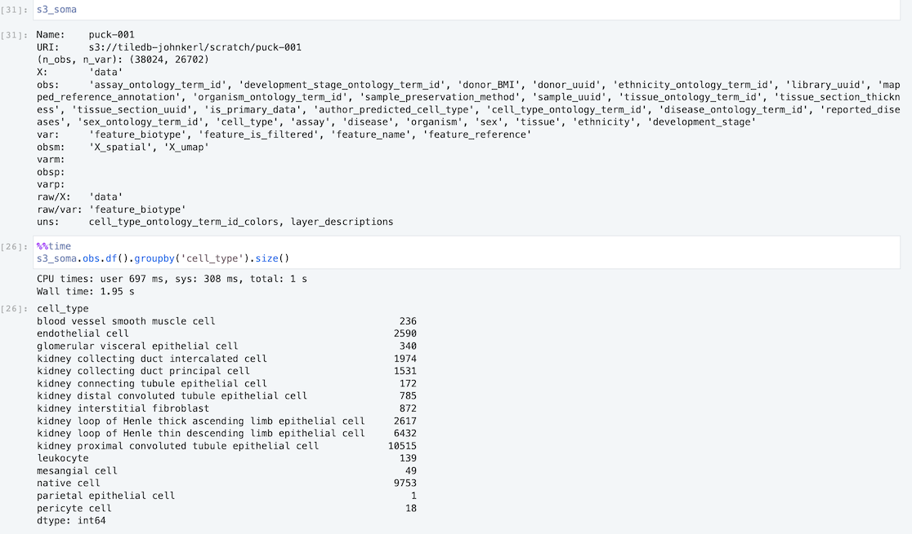
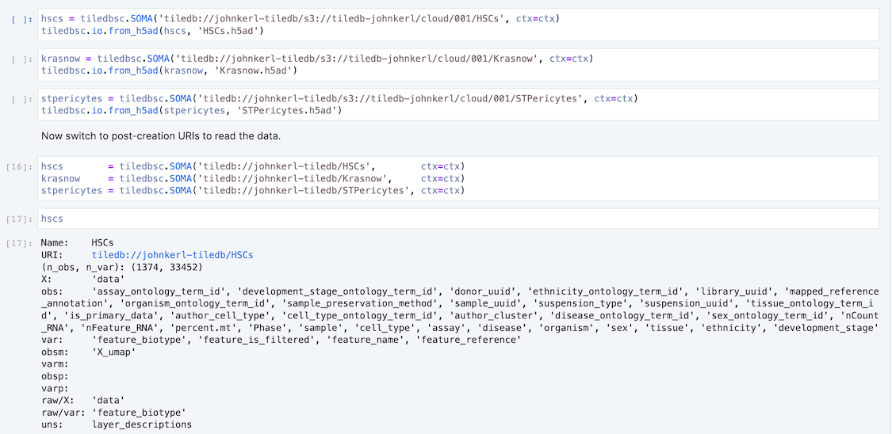
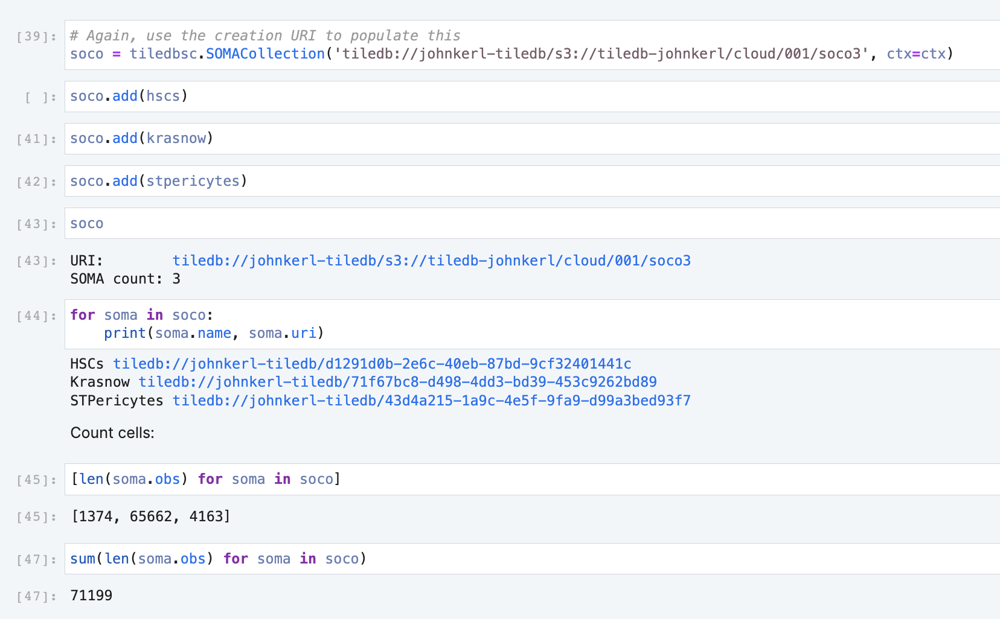

# Ingesting into SOMAs

A **SOMA** (Stack of Matrices, Annotated) is a [unified single-cell data model and API](https://github.com/single-cell-data/SOMA). A SOMA contains the kinds of data that belong in a single-cell dataset: `obs` and `var` matrices, `X` layers, and so on, offering **write-once, read-many semantics** via Python and R toolchains, with I/O to AnnData and Seurat formats, and interoperability with Scanpy and Seurat toolchains.

In the next few sections we'll ingest some AnnData files into SOMA storage three ways:

* To notebook-local disk
* To S3 storage
* To TileDB Cloud storage

Notebook-level storage is great for quick kick-the-tires exploration.

Cloud-level storage is crucial for at-scale, beyond-core analysis.

## Local ingestion

If you have an in-memory `AnnData` object, you can ingest it into a SOMA using `tiledbsc.io.from_anndata()`:

```
pbmc3k = scanpy.datasets.pbmc3k_processed()
local_soma = tiledbsc.SOMA('pbmc3k')
tiledbsc.io.from_anndata(local_soma, pbmc3k)
```

We'll focus from here on out mainly on ingesting from H5AD disk files.  Given local
`pbmc3k_processed.h5ad`, as in the previous section, we can populate a SOMA.

```
local_soma = tiledbsc.SOMA('pbmc3k')
tiledbsc.io.from_h5ad(local_soma, './pbmc3k_processed.h5ad')
```

Now we can examine the data, using things like the following:

```
local_soma
local_soma.obs.keys()
local_soma.obs.df()
local_soma.obs.df().groupby['cell_type'].size()
local_soma.obs.df().groupby['louvain'].size()
local_soma.uns['louvain_colors'].to_matrix()
```




## S3 ingestion

To ingest into S3, simply provide an S3 URI as the destination. The simplest way to get S3
credentials set up is to export the `AWS_ACCESS_KEY_ID`, `AWS_SECRET_ACCESS_KEY`, and
`AWS_DEFAULT_REGION` environment variables -- please see the
[public TileDB Cloud notebook](https://cloud.tiledb.com/notebooks/details/johnkerl-tiledb/d3d7ff44-dc65-4cd9-b574-98312c4cbdbd/preview) for examples.

```
s3_soma = tiledbsc.SOMA('s3://mybucket/scratch/puck-001', ctx=ctx)
tiledbsc.io.from_h5ad(s3_soma, './Puck_200903_10.h5ad')
```



## TiledB Cloud ingestion

Again we simply vary the destination URI, this time to `tiledb://...`. The simplest way to configure
TileDB Cloud access is to export the `TILEDB_REST_TOKEN` environment variable (which is done already for you
within TileDB Cloud notebooks).  See
[here](https://docs.tiledb.com/cloud/how-to/account/create-api-tokens) for how to create an API
token.

For upload to TileDB Cloud, we use _creation URIs_. Here you indicate your target namespace along with S3 storage. The SOMA name will be taken from the last component of the creation URI

* Example creation URI: `tiledb://mynamespace/s3://mybucket/path/to/somaname`
* Example post-upload URI: `tiledb://mynamespace/somaname`

```
hscs = tiledbsc.SOMA('tiledb://johnkerl-tiledb/s3://tiledb-johnkerl/cloud/001/HSCs', ctx=ctx)
tiledbsc.io.from_h5ad(hscs, 'HSCs.h5ad')
hscs = tiledbsc.SOMA('tiledb://johnkerl-tiledb/HSCs', ctx=ctx)
```



## Scripted ingestion

Alternatively, especially for bulk/batch/scripted jobs, you may with to use the [ingestor script](../tools/ingestor) to ingest [files you've downloaded](obtaining-data-files.md) into SOMAs:

```
tools/ingestor -o /mini-corpus/tiledb-data -n /mini-corpus/anndata/0cfab2d4-1b79-444e-8cbe-2ca9671ca85e.h5ad
tools/ingestor -o /mini-corpus/tiledb-data -n /mini-corpus/anndata/10x_pbmc68k_reduced.h5ad
...
```

Note this can take several hours total for multi-gigabyte datasets. The benefit of using an
optimized storage solution (with admittedly non-negligible ingest time) is that all subsequent
queries benefit from that optimized storage. In particular, various cross-corpus data queries shown
in these examples take just seconds or minutes.

A key point is **write once, read from multiple tools** -- in particular, using `tiledbsc-py` (this
package) or [`tiledbsc-r`](https://github.com/TileDB-Inc/tiledbsc) you can read SOMAs in either
language, regardless of which language was used to store them. This lets you use
best-in-class/state-of-the-art analysis algorithms, whichever language they're implemented in.

# Populate a SOMA collection

Once you have SOMAs, you can optionally add them to a _SOMA collection_ -- a list-of-SOMAs object,
storable on local disk, S3, or the cloud, designed for multi-SOMA slicing and querying, which can be
permissioned and shared like any other TileDB Cloud object.



## Scripted population

Alternatively, especially for bulk/batch/scripted jobs, you may with to use the [populator script](../tools/populate-soco) to mark SOMAs as members of a SOMA collection:

```
populate-soco -o /mini-corpus/soco --relative false -a /mini-corpus/tiledb-data/0cfab2d4-1b79-444e-8cbe-2ca9671ca85e
populate-soco -o /mini-corpus/soco --relative false -a /mini-corpus/tiledb-data/10x_pbmc68k_reduced
...
```

or simply

```
populate-soco -o /mini-corpus/soco --relative false -a /mini-corpus/tiledb-data/*
```

Note this is quite quick.

As a keystroke-saver, use the `tools/ingestor` script's `--soco` option which will populate the SOMA
collection at ingest time, so you don't even have to run `populate-soco` as an afterstep.

```
tools/ingestor -o /mini-corpus/tiledb-data --soco -n /mini-corpus/anndata/0cfab2d4-1b79-444e-8cbe-2ca9671ca85e.h5ad
tools/ingestor -o /mini-corpus/tiledb-data --soco -n /mini-corpus/anndata/10x_pbmc68k_reduced.h5ad
```
