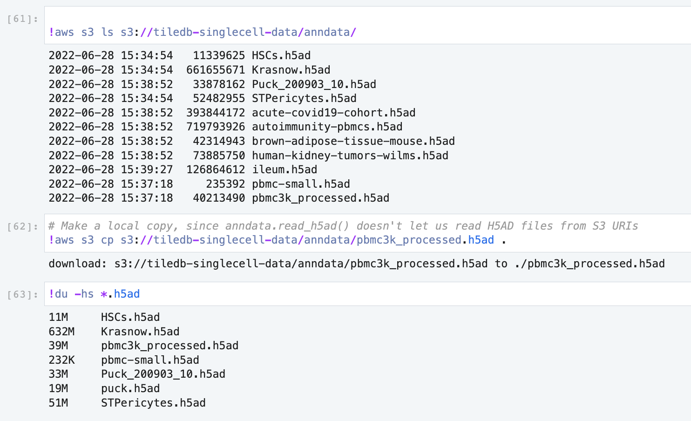

# Obtaining AnnData files

This Python package supports import of H5AD and 10X data files.

For example, you can visit [https://cellxgene.cziscience.com](https://cellxgene.cziscience.com) and
select from among various choices there and download.

:::{.callout-tip}
See also the
[public TileDB Cloud notebook](https://cloud.tiledb.com/notebooks/details/johnkerl-tiledb/d3d7ff44-dc65-4cd9-b574-98312c4cbdbd/preview).
:::

## Public bucket

The public S3 bucket `s3://tiledb-singlecell-data/anndata` contains several H5AD files you can use.

You can copy one of these sample files to your current directory as follows:

```
aws s3 cp s3://tiledb-singlecell-data/anndata/pbmc3k_processed.h5ad .
```


