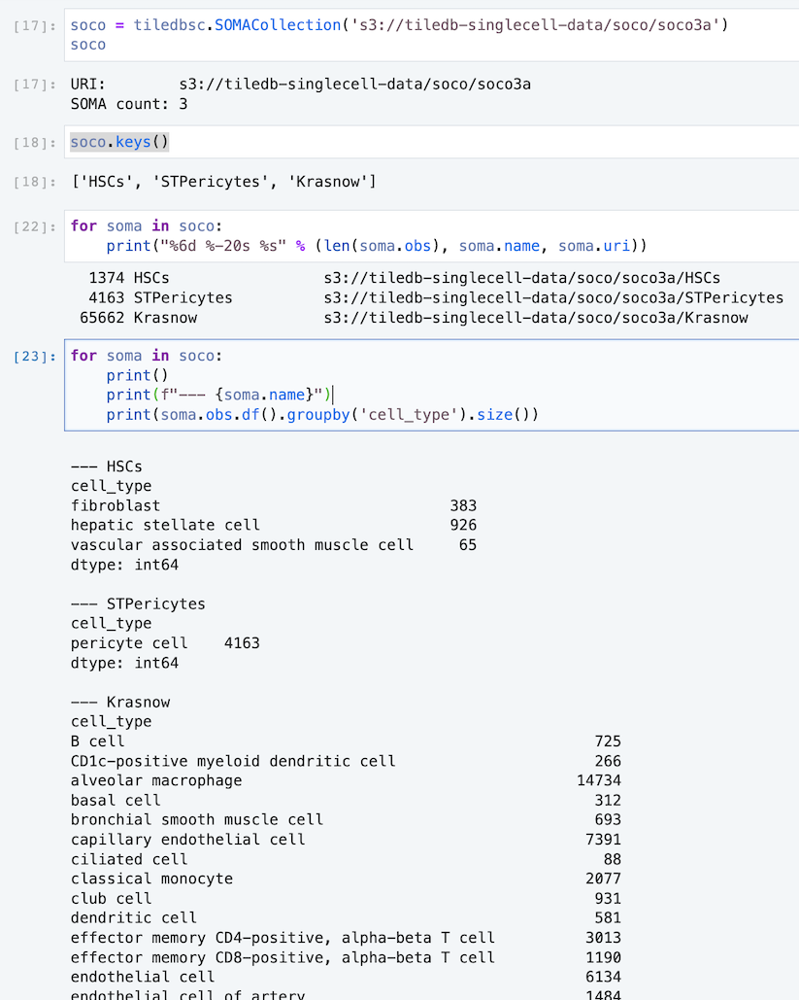

Next, let's do some cross-cutting queries over schemas of all SOMAs in the collection, querying
annotation data (`obs` and/or `var`) to see what we have, in preparaton for slice and batch queries
afterward.

## Total cell-counts

As noted in the [public TileDB Cloud notebook](https://cloud.tiledb.com/notebooks/details/johnkerl-tiledb/d3d7ff44-dc65-4cd9-b574-98312c4cbdbd/preview), we prepared an example SOMA collection in the S3 public bucket:

```
soco = tiledbsc.SOMACollection('s3://tiledb-singlecell-data/soco/soco6')
for soma in soco:
  print("%-20s %s" % (soma.name, soma.uri))
```

```
acute-covid19-cohort s3://tiledb-singlecell-data/soco/soco6/acute-covid19-cohort
human-kidney-tumors-wilms s3://tiledb-singlecell-data/soco/soco6/human-kidney-tumors-wilms
autoimmunity-pbmcs   s3://tiledb-singlecell-data/soco/soco6/autoimmunity-pbmcs
ileum                s3://tiledb-singlecell-data/soco/soco6/ileum
brown-adipose-tissue-mouse s3://tiledb-singlecell-data/soco/soco6/brown-adipose-tissue-mouse
Puck_200903_10       s3://tiledb-singlecell-data/soco/soco6/Puck_200903_10
```

This collection includes data on about 230K cells:

```
>>> cell_counts = [len(soma.obs) for soma in soco]

>>> cell_counts
[59506, 4636, 97499, 32458, 2223, 38024]

>>> sum(cell_counts)
234346
```

## Query cell counts

Let's find out -- before running a query involving full `X` data -- solely by looking at the smaller `obs` data, how many cells would be involved if we were to query for, say, `"B cell"`:

```
>>> query_cell_counts = [len(soma.obs.query('cell_type == "B cell"').index) for soma in soco if 'cell_type' in soma.obs.keys()]

>>> query_cell_counts
[6131, 0, 510, 3183, 529, 0]

>>> sum(query_cell_counts)
10353
```

## Counts by metadata values

```
soco = tiledbsc.SOMACollection('s3://tiledb-singlecell-data/soco/soco3a')
soco

soco.keys()

for soma in soco:
    print("%6d %-20s %s" % (len(soma.obs), soma.name, soma.uri))

for soma in soco:
    print()
    print(f"--- {soma.name}")
    print(soma.obs.df(attrs=['cell_type']).groupby('cell_type').size())
```



## More reconnaissance

See also [collection-counts.py](collection-counts.py) for some additional material.

For example:

```
----------------------------------------------------------------
Per-SOMA values for cell_type

SOMA acute-covid19-cohort
                                 count
name                                  
monocyte                         29878
CD8-positive, alpha-beta T cell   8658
CD4-positive, alpha-beta T cell   6726
B cell                            6131
natural killer cell               3248
alpha-beta T cell                 1659
dendritic cell                    1038
platelet                          1007
plasmablast                        586
plasmacytoid dendritic cell        575

...
```

```
----------------------------------------------------------------
Counts of SOMAs having cell_type

obs_label cell_type
                                                    count
name                                                     
B cell                                                  5
platelet                                                5
dendritic cell                                          4
mature NK T cell                                        4
neutrophil                                              4
plasma cell                                             4
animal cell                                             3
myeloid cell                                            3
natural killer cell                                     2
plasmablast                                             2
plasmacytoid dendritic cell                             2
erythrocyte                                             2
CD4-positive, alpha-beta T cell                         1
CD8-positive, alpha-beta T cell                         1
alpha-beta T cell                                       1
monocyte                                                1
eukaryotic cell                                         1
epithelial cell of nephron                              1
leukocyte                                               1
mesenchymal stem cell                                   1
native cell                                             1
CD14-low, CD16-positive monocyte                        1
CD14-positive monocyte                                  1
CD16-negative, CD56-bright natural killer cell,...      1
CD16-positive, CD56-dim natural killer cell, human      1
CD4-positive, alpha-beta memory T cell                  1
CD8-positive, alpha-beta memory T cell                  1
T cell                                                  1
conventional dendritic cell                             1
gamma-delta T cell                                      1
hematopoietic stem cell                                 1
immature B cell                                         1
memory B cell                                           1
mucosal invariant T cell                                1
naive B cell                                            1
naive thymus-derived CD4-positive, alpha-beta T...      1
naive thymus-derived CD8-positive, alpha-beta T...      1
regulatory T cell                                       1

Counts of SOMAs having tissue

obs_label tissue
        count
name         
blood       5
kidney      1
```

```
----------------------------------------------------------------
Collection-wide counts of values of cell_type

obs_label cell_type
                                                    count
name
monocyte                                            29878
naive thymus-derived CD4-positive, alpha-beta T...  26887
CD14-positive monocyte                              23648
myeloid cell                                        10261
naive B cell                                         8679
CD8-positive, alpha-beta T cell                      8658
B cell                                               8524
mature NK T cell                                     7755
CD16-positive, CD56-dim natural killer cell, human   6948
CD4-positive, alpha-beta T cell                      6726
CD8-positive, alpha-beta memory T cell               6224
erythrocyte                                          3918
CD16-negative, CD56-bright natural killer cell,...   3638
natural killer cell                                  3474
CD4-positive, alpha-beta memory T cell               3276
platelet                                             2926
mesenchymal stem cell                                2811
naive thymus-derived CD8-positive, alpha-beta T...   2387
CD14-low, CD16-positive monocyte                     1923
plasmablast                                          1825
T cell                                               1697
alpha-beta T cell                                    1659
epithelial cell of nephron                           1216
dendritic cell                                       1061
plasma cell                                          1025
animal cell                                           661
plasmacytoid dendritic cell                           650
conventional dendritic cell                           543
native cell                                           465
memory B cell                                         457
regulatory T cell                                     306
neutrophil                                            302
hematopoietic stem cell                               270
immature B cell                                       255
mucosal invariant T cell                              223
gamma-delta T cell                                    216
leukocyte                                             144
eukaryotic cell                                        28

TOTAL count    181544
dtype: int64
...
```
