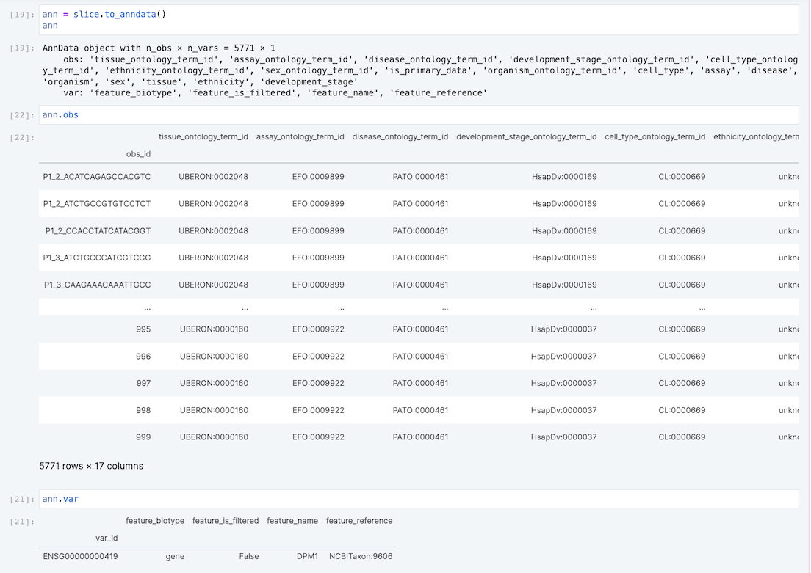

Here we show an example of doing a _slice query_ across a `SOMACollection` -- we extract a
relatively small subset out of the full collection for analysis.

:::{.callout-tip}
A key point is that these data (shown here on local disk) can likewise be stored on object stores
like S3.  This means you can _query_ large datasets without having to first _download_ large
datasets.
:::

:::{.callout-tip}
Another key point is that the _out-of-core processing_ showing here allows you to slice data out of
a collection which is far larger than fits in RAM.
:::

:::{.callout-tip}
Best S3 read performance is obtained by querying from an in-region EC2 instance, or a TileDB Cloud
notebook -- this is preferred to laptop-to-S3 reads.
:::

## Prepare the inputs

As shown in the [public TileDB Cloud notebook](https://cloud.tiledb.com/notebooks/details/johnkerl-tiledb/33c4fe81-d15f-43cd-a588-5c277cf70cb6/preview):

```
ctx = tiledb.Ctx({"py.init_buffer_bytes": 4 * 1024**3})
soco = tiledbsoma.SOMACollection("s3://tiledb-singlecell-data/soco/soco3", ctx)
```

Slices to be concatenated must all have the same attributes for their `obs` and `var`. If the input SOMAs were all normalized (see also [Uniformizing a Collection](uniform-collection.md)), we wouldn't need to specify `obs_attrs` and `var_attrs`. Since the input data here is heterogeneous, though, we find which `obs`/`var` attributes they all have in common.

```
obs_attrs_set = None
var_attrs_set = None
for soma in soco:
    if obs_attrs_set is None:
        obs_attrs_set = set(soma.obs.keys())
        var_attrs_set = set(soma.var.keys())
    else:
        obs_attrs_set = set(soma.obs.keys()).intersection(obs_attrs_set)
        var_attrs_set = set(soma.var.keys()).intersection(var_attrs_set)
obs_attrs = sorted(list(obs_attrs_set))
var_attrs = sorted(list(var_attrs_set))
```

## Do the query

```
slice = soco.query(
    obs_query_string='cell_type == "pericyte cell"',
    var_query_string='feature_name == "DPM1"',
    obs_attrs=obs_attrs,
    var_attrs=var_attrs,
)
ann = slice.to_anndata()
```

## Persist the output

```
slice_soma = tiledbsoma.SOMA('slice-query-output')
tiledbsoma.io.from_anndata(slice_soma, ann)
```

## Examine the results


